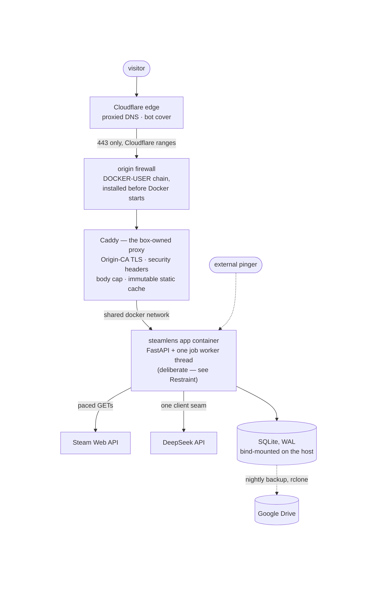
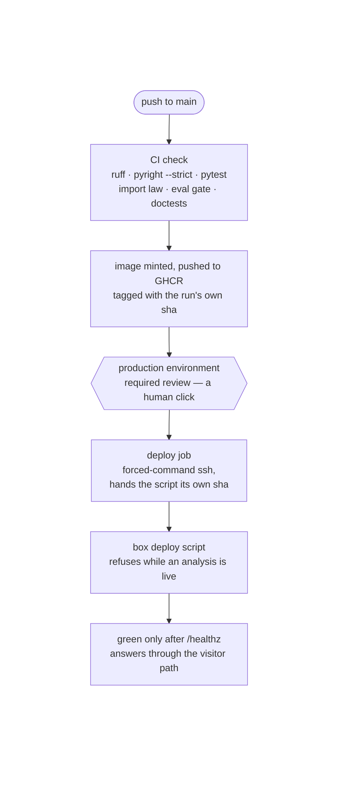
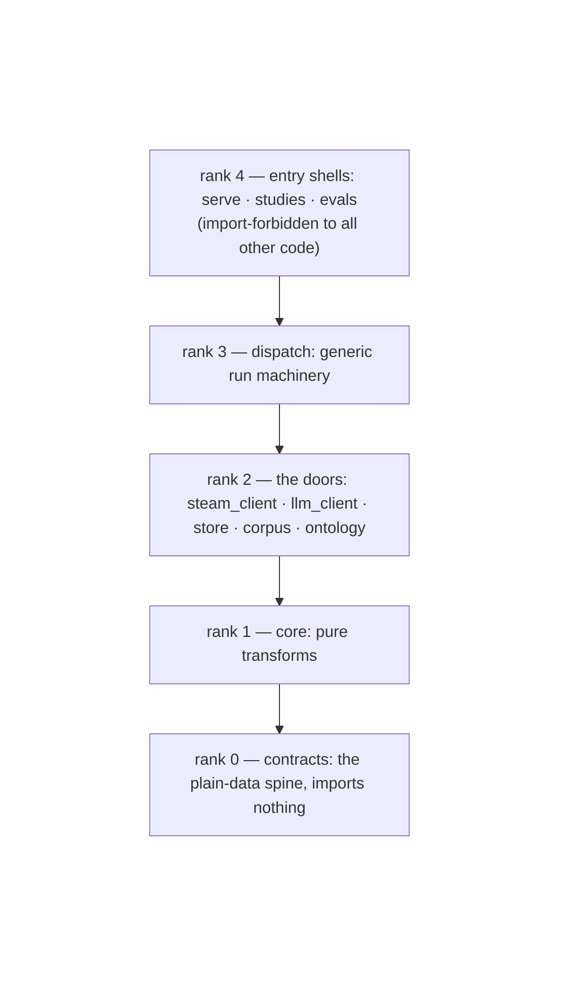
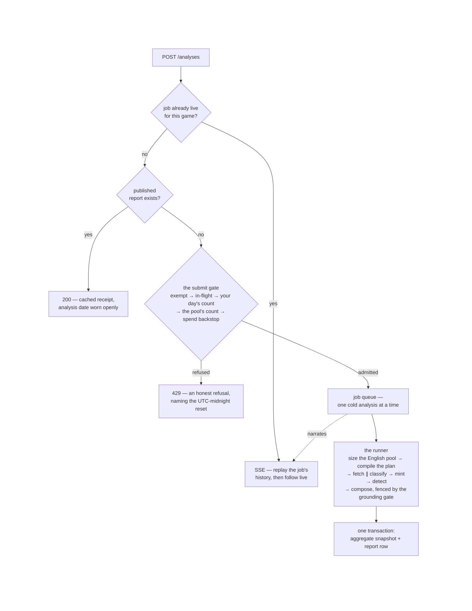

# ARCHITECTURE — steam-lens

How it's built and why that structure: a narrative snapshot, edited in place.
Decisions and their rationale → [DESIGN.md](DESIGN.md) (cited by name); the pitch →
[README.md](README.md).

*Snapshot of the completed project · last updated 2026-08-12 · milestones M0–M3
shipped; the app is live at steamlens.ardabasarici.dev. The report-interrogation
chat (M4) is designed-and-deferred (DESIGN: the roadmap redirect) and gets its own
architecture pass when it approaches.*

---

## The system in production

The deployed shape, outside-in: what a request crosses before any Python runs:



The box is a small hardened VPS (DESIGN: the box; key-only SSH, root login off,
ufw default-deny with SSH as the only host-level allowance, unattended upgrades).
Everything web-facing is containerized: **Caddy runs once per host as the box-owned
proxy** on a shared Docker network, and each project on the box is a self-contained
compose stack plus one Caddyfile stanza: the multi-project box made mechanical.
The app container publishes nothing itself; Caddy reaches it by compose DNS name.

The rules, stated once:

- **The origin answers only Cloudflare.** The DNS record is proxied (orange-cloud),
  so visitors never learn the box's address, and the origin firewall makes the
  hiding real: a DOCKER-USER-layer rule set admits only Cloudflare's published
  ranges to 443, installed by a systemd unit ordered before Docker so a reboot
  cannot open a window. Port 80 is retired outright; TLS to the origin rides a
  Cloudflare Origin CA pair (SSL Full (strict)), trusted only by the edge, which
  is exactly its one job.
- **Visitor identity survives the proxy chain by construction.** Caddy trusts
  Cloudflare's ranges as proxies and *replaces* `X-Forwarded-For` with the verified
  visitor IP: one entry, appended by our own proxy, which a forged header cannot
  displace. The app's gate reads exactly that last entry (DESIGN: the spend
  breaker).
- **The proxy carries the static walls; the app mints the dynamic one.** Baseline
  security headers, the 16 KB request-body cap, and the year-long immutable cache
  on content-hash-busted static assets sit in the Caddyfile; every response wears
  them, whichever route answered. The Content-Security-Policy alone is stamped by
  the app (`serve.web.csp`), because it carries a per-response nonce that a static
  config cannot mint (DESIGN: the Content-Security-Policy).
- **The database outlives everything.** SQLite (WAL) lives on the host filesystem,
  bind-mounted in; it survives every image and container rebuild, and the nightly
  backup reads it from the host without entering Docker: `sqlite3 .backup`,
  gzipped, shipped off-box to Drive by rclone under a token that can only touch
  files it created, with a dead-man ping watching the timer (DESIGN: backups;
  verified by restore at setup, not by upload).
- **Monitoring lives off the box.** `/healthz` answers the two real things cheaply
  (worker thread alive, database opens) and an external pinger watches it (a
  monitor self-hosted beside the app dies with it). The richer story (spend, job
  history, failure and cache rates) is `/ops`, an in-app product page over the
  same store (DESIGN: the observability step).

## The delivery pipeline

How code reaches that box: approval-gated delivery, deliberately short of
continuous deployment (DESIGN: approval-gated delivery):



The trust direction decides every mechanic. The box never builds: CI mints the
image, so what was tested is byte-for-byte what runs. The pipeline's SSH key is
forced-command, pinned to the box's deploy script: a leaked Actions secret can
trigger a deploy and nothing else. The job hands the script the run's *own* image
sha, so an approval clicked hours after the push ships exactly what was reviewed,
immune to `:latest` moving underneath; the box then retags `latest` to mean "last
approved deploy", which keeps **rollback = point compose at the previous sha tag**.
The script refuses, naming the job, while an analysis is live: a recreate would
cut a visitor's minutes-long, money-spending job mid-run, which is the argument
that kept a human on the trigger at all. The manual pull
(`docker compose pull && up -d`) survives as the runbook fallback; mechanics and
runbooks live in `deploy/box/README.md`.

## Inside the app — the rank law

Five ranks, imports strictly downward, enforced by a CI test. The entry shells at
the top compose everything; nothing composes them.



The rules, stated once:

- **The dependency law fails closed.** The import-graph test asserts the rank table
  on every build and refuses to fail open: every package under `src` must declare a
  rank to exist, relative imports are banned wholesale, and the entry shells
  (`evals`, `studies`) are import-forbidden to everything. A misplaced import is a
  red build, never a review finding.
- **The rendering wall is the law's one intra-package edge, pinned separately.**
  Everything presentational lives in `serve.web` (templates, static assets,
  view-model helpers), attached over the JSON app by the composition root, and the
  JSON surface never imports the renderer. The package-grained law cannot see an
  edge inside `serve`, so a dedicated import-scan test pins this wall (DESIGN: the
  frontend's rendering boundary).
- **The two-track rule.** Every envelope carries an `Origin` tag and the number
  mint folds survey-origin members under the pinned version only: the only door to
  a displayed number. A distinct eval origin stays parked with its trigger
  (DESIGN's parked decisions).
- **One door to Steam.** All live access goes through `steam_client`: one paced,
  retried GET chokepoint, identity guarded, provenance-reporting; and the
  transport is injectable, so the server, the smoke test, and any future caller
  share one politeness budget by construction instead of each minting a second.
- **One door to models.** All LLM calls go through `llm_client`: per-stage routing,
  an atomic budget reserve before dispatch, typed failures, and the content-keyed
  response archive (a bought response is never re-paid). The serving composer
  joined the *classify* client's routes rather than standing up a second client:
  two stages on one model must not each believe they own its quota (DESIGN: model
  prose).
- **Functional core, effects at the shell.** `core` is pure transforms over
  `contracts` records; every I/O lives at rank 2; the entry shells only compose.
  The serving pipeline holds the line: the whole certified sync pipeline runs in a
  worker thread under the async HTTP shell, and no async creeps below `serve`.
- **Narration is a seam, not a habit.** Producers depend on the one-method `Sink`
  protocol from `contracts`; each running context binds its own sink: the offline
  drivers' tee'd log, the serving job's replayable event history, ad-hoc collectors
  in tests. Observability is structural, not retrofitted.

### The life of an analysis job

The serving path: what happens when a stranger submits a game (DESIGN: the
serving skeleton · the spend breaker · serving persistence):



Inside the runner, everything statistical is a certified seam composed, never
reimplemented: the fetch plan comes from `core/sampling`'s compiler (the sampling
study's own certification target, so the measured convergence describes code that
ships), the fetch runs the validated windowed path with the plan contract's quota
stop, and the classify leg is the census instrument verbatim (same worker, same
model identity, same retry ladder). Fetch and classify overlap through a bounded
producer-consumer queue fed window by window, so a cold report's wall-clock is
max(fetch, classify) rather than their sum and the first narrated labels appear
seconds in. Sample membership files into a stored manifest as windows land, and
everything downstream is membership-scoped, which is simultaneously the mint's
integrity rule, the re-run collision fix, and the resumes-nearly-free promise
(the structural story below). A job that classified nothing publishes no report;
snapshot and report row commit together or not at all.

The narration bridge is deliberately poll-based: the job holds its replayable
event history in memory (that's what replay-on-connect serves), the SSE generator
polls snapshots at a config tick, and narration lands at seconds scale, so a
sub-second poll is invisible to a viewer, while per-viewer listener queues would
be lifecycle machinery buying imperceptible latency (DESIGN: narration streams
over SSE).

### The life of an offline run

Every dispatch run (census, judge, experiment cell) is regenerable from its
manifest and resumable by construction:

```
  RunConfig (the resolved dial)
        │
        ├── mint_run_id · code_version · config_hash   (dispatch/stamp)
        ▼
  Provenance record ──► runs/<run_id>/ opened by dispatch/run_context:
        │                 run.log (line-buffered, tee'd to console — tail it live)
        │                 two Store connections (client writes on worker threads,
        │                 driver writes on the main thread; WAL carries coordination)
        ▼
  resume-clean selection (an envelope or durable failure mark closes a review)
        ▼
  batch passes ──► LLM door ──► envelopes + archived responses + ledger rows
        ▼
  build_manifest ──► runs/<run_id>/manifest.json   (true counts even when aborted)
```

The eval side closes the provenance loop in CI: the committed `eval/ci/` fixture
holds the runs of record, and the gate regenerates their scores on every build:
an exact-digit mismatch fails; the deliberate-change path is a scorer-string bump
plus pin re-export (DESIGN: the evals-in-CI gate).

## Module responsibilities

One line per module; field detail and contracts live in the docstrings (pdoc
renders the reference; regen script committed, output never hand-edited).

| module | single job |
| --- | --- |
| `contracts/` | the frozen-dataclass records crossing every seam (reviews · classification · aggregates · sampling plans · reports · ops rows · provenance · LLM and Steam door records · eval runs · telemetry), plus the enums and the `Sink` narration protocol |
| `core/normalize` | two-slot label resolution: surface index over the pinned vocabulary, conservative match keys, candidates preserved in reviewer wording |
| `core/classify` | the versioned classify prompt build + strict response parse with per-idx salvage (the LLM call itself stays in the shell) |
| `core/aggregate` | the number mint: label pool + scope → per-game aspect aggregates, raw tallies only |
| `core/sampling` | the plan compiler: histogram + policy → an executable `FetchPlan`; deterministic, integer-only, the sampling study's certification target |
| `core/intervals` | the candidate interval formulas the study raced (Wilson · exact bootstrap · percentile bootstrap); the winner ships |
| `core/allowance` | the shipped interval rule: display bands, regime test, the ruled per-band allowance constants a report quotes |
| `core/detect` | episode markers: spike-versus-trailing-median over the native histogram rollup, kept deliberately dumb: no model, no cause |
| `core/compose` | compose-stage selection + prompt build, the pure half of the narrative stage: evidence floor, pinned-with-numbers / candidates-as-names |
| `core/grounding` | the numeric-grounding gate: every non-quote numeral must match the job's own outputs, every quote verbatim; emits the certificate spans the page renders |
| `ontology/` | the artifact loader + the versioned TOML codebooks (`v1` — gold's identity pin and packaged default; `v2` — the current codebook, pinned by explicit path) |
| `corpus/` | the frozen-snapshot reader beside the live door: usable filter, drop arithmetic, the door's own record parser (imported, never forked) |
| `steam_client/` | the live door: paced/retried transport chokepoint (injectable: one politeness budget per process) · wire parsers · identity guard · the windowed walk engine with cursor fallback · feasibility · totals |
| `llm_client/` | the model door: stage routing + budget/pacing · the client (reserve, retries, cache/ledger composition) · Gemini and OpenAI-compat adapters · cache-split cost pricing · typed failures · in-memory bindings for rigs |
| `store/` | SQLite (WAL): schema + gated migrations · review/label/archive/ledger/eval-run surfaces · the serving tenants (sample manifest, reports, admissions, refusals, job journal) · the ops read model, IP-free by shape |
| `dispatch/` | generic run machinery, study-blind: tee'd narration sink · run/config/code stamps · the run-shell context · the chunk/pass batch engine · `census_arm`, the production annotator as a citable instrument with its extra-routes door |
| `serve/` | the serving shell: the job + one-at-a-time queue · the runner (the analysis pipeline over certified seams) · the submit gate · SSE encoding and replay-then-follow · the compose-call shell with its failure ladder · config dials · the composition root (`serve.main`, env-wired) |
| `serve/web` | the renderer, the one module a frontend rewrite touches: Jinja templates, static assets, view models for report and ops pages, the CSP stamp |
| `studies/` | offline entry shells: census labeling + aggregate minting · the sampling study's simulation and measurement drivers · the detect calibration pass · the allowance-constant mint arithmetic |
| `evals/` | the certification harness: gold + holdout loaders · pure scoring + bootstrap · certify · the judge instrument and its dispatch shells · agreement · the misattribution audit · the prompt-injection canary set + runs · registered experiments · the CI fixture exporter/gate |

Declared in the rank table but deliberately empty: `pipeline` and `cli`, reserved
ranks whose need never materialized (the restraint section below).

## Repo layout

```
src/steamlens/       the packages above, under the rank law
tests/               the suite: behavior, the import law, escaping walls, the eval gate
eval/                versioned instruments: gold + holdout sets, audit sheets, canaries, the ci fixture
probes/              one-shot investigation scripts; their findings live in captures/
scripts/             gold tooling · docs regen · the ledger reprice (one sanctioned revision)
deploy/box/          provision-as-code: compose, Caddyfile, firewall + backup units, the runbook
.github/workflows/   CI and the approval-gated deploy
docs/api/            the pdoc-rendered reference — generated, never hand-edited
data/ · runs/        gitignored working state: the local db, corpus snapshot, run directories
```

## Structural stories

### The law is executable architecture, and it grew teeth after paying for it

The rank table began as documentation with a test; the full-base review (2026-07-27)
found the test blessing exactly the erosion it existed to stop: two entry shells
shared a rank, so `evals` imported eight names from the census driver's interior
with a green build, and unranked packages or relative imports were simply
invisible. The architecture pass inverted that: the shared machinery moved down
into `dispatch`, the misfiled reader moved to `corpus`, and only then was the law
tightened to match (entry shells import-forbidden, rank declaration a
precondition of existence, relative imports banned). Order mattered: the law locks
the shape that should exist, not the one that happened to.

### The renderer is the wall the law cannot see

`serve` is one rank, so the package-grained law is blind to its interior, and the
interior holds the project's most change-prone boundary: presentation. The wall is
therefore pinned by its own import-scan test: `serve.web` consumes only the
published surfaces an external frontend would (the `Report` contract, the JSON/SSE
routes), attached over the JSON app by the composition root, never imported by it.
Presentation adaptation happens in view models, never as display-shaped fields on
stored contracts or the SSE vocabulary; hostile-content escaping belongs to
whatever renders. A frontend rewrite replaces this one package and rebuilds its
escaping tests (the wall is per-rendering-technology by design) and touches
nothing below (DESIGN: the frontend's rendering boundary).

### The sync pipeline never learned it went online

Deployment did not rewrite the engine; it composed it. FastAPI owns HTTP (intake,
cache reads, the SSE response), and the whole certified sync pipeline runs in a
plain worker thread; the only place the two worlds touch is the job's thread-safe
event history. The runner's legs are the certified instruments verbatim: the plan
from the study's own compiler, the fetch through the validated windowed path, the
classify leg the census arm itself. No async below `serve`, no second
implementation of anything statistical, which is what lets the report page quote
the study's measured tolerances as *its own* (DESIGN: the serving skeleton).

### Membership is the label economy's one key

The stored sample manifest (members filed window by window as the fetch lands)
scopes both sides of the label economy: classify selects the members still owed a
verdict under the versions triple, and the mint folds membership ∩ label pool. One
query shape yields three guarantees at once: a verdict bought by *any* prior run
counts for this job (labels are never re-paid), a re-run cannot die on a duplicate
envelope (the collision fix), and a crashed job resumes nearly free. The
content-keyed response archive sits beneath as the second layer of the same
promise: an identical request is answered from disk (DESIGN: serving
persistence).

### Drivers are composition roots; the machinery exists once

Four dispatch drivers (census, two judge shells, the experiment cells) once
carried private copies of the same run shell, batch engine, and stage emitter;
and the copies had measurably drifted. Now `dispatch` owns each mechanism once;
what deliberately did **not** unify is policy: each driver keeps its own abort
ladder, manifest payload, retry semantics, and outcome writer; a shared `Driver`
framework was declined because it would turn those real differences into callback
plumbing. The serving runner joined as the fifth composer, not a framework client.

### Two instrument blocks name the annotators

The production model's identity (`dispatch/census_arm`) and the judge's
(`evals/judge_dispatch`) are symmetric instrument blocks: model id, provider,
prices, generation config, and the client builder in one citable place each.
Certification and the agreement read import "the production model under judgment"
as an instrument, the experiment cells re-dispatch it under controlled conditions,
and the serving composer routes through its extra-routes door: one identity,
never a constant fished out of a driver.

### Certification consumes the system, never the reverse

`evals` sits at the top rank and is import-forbidden: the harness reads the same
label pool, the same ontology artifacts, and the same scoring core the production
path uses, and nothing in the production path can reach back into it. Gold is
provider-neutral by construction, the judge is a second annotator rather than a
verifier (DESIGN: the judge), and the CI gate re-scores the committed runs of
record to exact digits: a quiet change to any scoring input is a red build, not a
drifted number. The prompt-injection canary set extends the same stance to the
serving surfaces: the render-side half gates deterministically in CI, the
model-side half is a harness probe at prompt-change cadence, and a per-run nonce
keeps the archive from reporting last month's walls as holding today (DESIGN: the
prompt-injection canary set).

### Privacy is enforced by shape, not by renderer discipline

The public `/ops` page renders whatever its read model produces, so the read
model is what cannot betray it. `OpsReads` is a read-only tenant over journals the
writing tenants own, and its contract rows structurally cannot carry an IP; the
refusals journal records which guard fired and never who tripped it. The page
could be handed to any renderer tomorrow and the constraint would hold, because it
lives a layer below presentation (DESIGN: the observability step).

## Toolchain & layout

Python **3.13**, `src/steamlens/` **src-layout**; **uv** for resolve + lock. Gates
on every change: **ruff check** (lint only: code is hand-formatted to house
style; the formatter is deliberately unused), **pyright `--strict`**, **pytest**
with `--doctest-modules`, the import-graph law, the render-side canary walls, and
the exact-digit eval gate over the committed fixture. **pdoc** renders the API
reference from docstrings. Serving and delivery: **FastAPI + uvicorn** in a
**Docker** image minted by CI to **GHCR**, composed on the box behind **Caddy 2**
and **Cloudflare** (free tier, proxied DNS); secrets ride the repo encrypted
(**SOPS + age**); backups ship by **rclone**. The box never builds, and the repo
never learns the box's address.

## Deliberately not done (restraint)

- **No SPA, no bundler.** Two server-rendered pages plus tens of lines of vanilla
  JS for the one dynamic surface (the narration stream). The rendering wall makes
  a richer frontend a one-package replacement; build it when the product grows a
  surface that earns it.
- **No external job queue.** Redis/Celery buy nothing at one box, one Steam
  politeness budget, one job at a time; the accepted cost (a deploy kills a
  running job; the deploy script's live-job refusal exists for exactly this) is
  cheaper than the machinery. The polled SSE snapshot surface is deliberately the
  seam an external event log behind several replicas would satisfy unchanged.
- **No driver framework.** The shared machinery is functions and one context
  manager, not a base class; revisit only if per-driver policy itself starts
  duplicating.
- **`pipeline` and `cli` stay reserved, empty.** The ranks were declared ahead of
  M3, but the serving runner composed its stages in `serve` and no second consumer
  of the same compositions appeared; the offline drivers kept theirs. The ranks
  fill when a real shared composition exists to house, not before.
- **No tier-3 observability platform.** Langfuse, Prometheus+Grafana, and
  LangSmith all fail "does *this product* need it?" on a 4 GB box running one
  process over one SQLite file. The concepts they embody (traces, spans, cost per
  token, latency, failure and cache rates) are what the job journal, ledger, and
  admissions/refusals journals implement natively (DESIGN: the observability
  step).
- **No Litestream.** Nightly `.backup` + off-box shipping matches a
  one-writer, low-write store; the trigger to revisit is the chat milestone's
  write pattern.
- **No auto-docs on the public surface.** FastAPI's `/docs`, `/redoc`, and
  `/openapi.json` shipped as an unexamined framework default and were declined
  deliberately once seen (no consumer exists), and the absence is pinned by test
  (DESIGN: the Content-Security-Policy pass).
- **No investigation machinery.** The chat milestone (M4) is deferred whole; its
  retrieval modules get their own architecture pass when it approaches.
