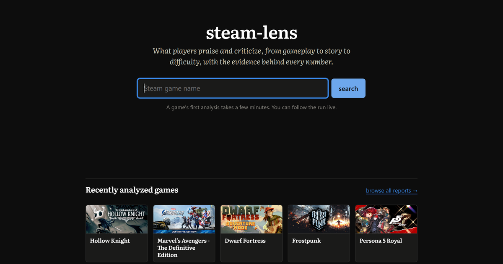
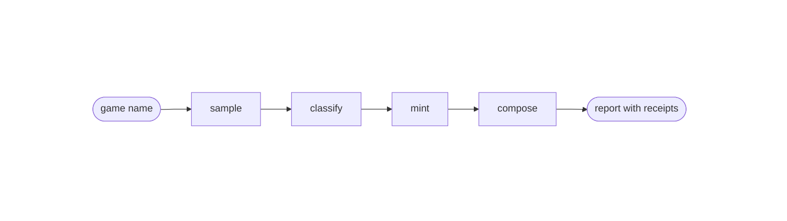

<div align="center">

# steam-lens

**What do players actually think about a game — and can you check every claim
yourself?**

[](https://github.com/arda-basarici/steam-lens/actions/workflows/ci.yml)
[](https://steamlens.ardabasarici.dev)

[](LICENSE)



*(interim shot — full page captures land after the current polish pass)*

</div>

SteamLens reads Steam reviews the way an analyst would: it samples a game's
reviews under a measured tolerance, classifies each one against a versioned
aspect vocabulary, aggregates deterministically, and composes a narrative that
structurally cannot state a number its own outputs don't back. The LLM call is
deliberately the smallest part of the system — the work is the instrument built
around it: a human-anchored gold set, a calibrated cross-family judge, bootstrap
CIs on every reported number, an eval harness that gates CI, and the system's
own error rates published beside its claims, inside the product.

> [!IMPORTANT]
> **Live: [steamlens.ardabasarici.dev](https://steamlens.ardabasarici.dev)** —
> type a game, watch the analysis narrate itself, read the report with its
> receipts.

> [!NOTE]
> Scope, stated plainly. Every displayed number comes from a fixed survey
> sample; stories quote retrieved reviews and never mint numbers. Not vanilla
> sentiment scoring; not fake-review accusations (unverifiable — cut by
> design); not cross-game comparison (the per-report frame is the product's
> identity); not a notebook with a URL.

## The pipeline at a glance



**sample** — the certified windowed draw · **classify** — the F1-certified
labeler · **mint** — deterministic aggregation · **compose** — fenced by
grounding gates. Every stage narrates itself live over SSE; every numeral the
prose states must match the job's own outputs; every quote must verify verbatim
before display.

This is the ten-second view. The whole deployed system — edge to database, the
delivery pipeline, the import-rank law, the life of an analysis job — is drawn
in **[ARCHITECTURE](ARCHITECTURE.md)**; every decision behind it, with its
alternatives and why they lost, is argued in **[DESIGN](DESIGN.md)**.

## The build, milestone by milestone

| milestone | what shipped | the headline |
|---|---|---|
| smoke tests (M0) | Steam's undocumented API surface verified from a datacenter host | the data shapes every later decision cites |
| extraction + eval (M1) | a 135,260-review census across 49 games, labeled end-to-end for $3.80 | **F1 0.766 [0.713–0.811]** vs human gold |
| sampling study (M2) | the windowed draw certified against census ground truth | 95% intervals honest: coverage 0.958–0.959 certified, **0.971 held-out** |
| deployment (M3) | the live app on a hardened VPS — approval-gated CD, spend breaker, LLMOps journals | a full report for **$0.007–0.017**, walls probed live |

The report-interrogation chat (M4) is designed and deliberately deferred — the
docket and leanings are recorded in [DESIGN](DESIGN.md); the report product
stands complete without it.

## Measured, not asserted

Every number below has a baseline, a CI, and an honest caveat — and the ones a
user should see ship inside the product's trust panel, not just here.

| claim | measured | the honest caveat |
|---|---|---|
| label quality vs human gold | **F1 0.766 [0.713–0.811]** | 250-review gold set, blind-labeled *before* any model output existed; single annotator, disclosed |
| the judge, calibrated before use | F1 0.816 vs gold — paired **Δ +0.050 [+0.019, +0.083]** over production | a different model family, so no self-preference |
| the judge check off-gold | **F1 0.791 [0.772–0.810]** agreement on a 1,000-review census sample | no quality cliff outside the gold set's reach |
| fabricated quotes | **0 in 163,842 stored evidence spans** | failing quotes are nulled at write time; the deployed composer passes the same verbatim gate |
| misattribution, by human audit | **11.6% [6.6–19.6]** of sampled claims | dominated by close-family routing (bugs↔stability); zero far-field misreads |
| the honest weak spot | fresh-holdout agreement **0.557 [0.477–0.634]** | weakest in the long tail (0.444); polarity near-perfect once aspects match (0.988) — shipped in the trust panel |
| the sampling promise, held out | coverage **0.971**, tolerance 0.991 at the certified n=1,000 | review-bombing breaks coverage by 5% contamination — so marked windows are blanked, residual disclosed |
| the labeler bake-off | the +0.034-F1 stronger candidate **rejected at ~12× the cost** | the gap closes at the frozen production shape |

## The engineering underneath

What separates this from prompt-and-parse, in the places a code reader will
look:

- **Evals gate CI.** Both evaluation runs of record re-score deterministically
  in CI from a committed fixture; an exact-digit mismatch fails the build, and
  a deliberate semantics change must bump the scorer identity and re-export the
  pins in the same commit.
- **A narrative that cannot launder numbers.** The composer is fenced by
  deterministic gates: every numeral in composed prose must match the job's own
  outputs at the numeral's precision, every quote must be a verbatim substring
  of supplied evidence — violations retry once, then offending sentences drop,
  then the report renders numbers-and-quotes-only with a disclosed line. The
  gate emits a certificate the page renders, so the reader *sees* model voice
  vs. minted fact.
- **Spend is admission-controlled and journaled.** A public submit gate counts
  fresh analyses per visitor and per day (a count can't be burst past the way a
  settling dollar total can), a per-job budget reserves atomically before every
  call, and the ledger records billed truth — cache-split pricing, per-call
  latency, every row joined to its job.
- **Statistical integrity is enforced by structure.** Displayed numbers can
  only come from survey-origin labels: origin tags in the pool, an origin
  predicate in the store's fold, and a CI import-graph test that keeps the
  walls standing. Uncertainty is first-class — bootstrap CIs, paired
  comparisons, and statistics that say "undefined" instead of a fake 0.0.
- **The delivery pipeline trusts nothing by default.** CI mints the image; a
  human click ships the exact reviewed sha over a forced-command SSH key that
  can deploy and do nothing else; the deploy script refuses while a visitor's
  job is live; rollback is the previous tag. The origin answers only
  Cloudflare, and a prompt-injection canary set measures the serving walls —
  render-side in CI, model-side at prompt-change cadence.
- **The seams are hand-built where the seam is the skill.** Raw httpx behind
  one typed provider seam (vendor SDKs rejected with recorded reasons); SQLite
  with a hand-rolled migration runner and a content-addressed archive of raw
  provider output; every artifact carries its provenance (run id, code sha,
  config hash, version pins). Swapping the LLM provider is a config edit plus
  one adapter behind the same seam.

## What it serves

- **Aspect report** — strengths/weaknesses by aspect (combat, story,
  performance, …), every share carrying its calibrated interval and expandable
  verbatim quotes, dated.
- **Narrated live analysis** — a cold game streams its own pipeline over SSE:
  fetch, classify, mint, compose, watched in real time.
- **Trust panel** — sample provenance, language mix, the interval regime this
  game got, and the published instrument numbers above, scoped honestly inside
  the product.
- **Episode markers** — statistically detected review-activity spikes on the
  timeline, threshold calibrated by looking at 35 live histograms, no cause
  ever attributed.
- **Ops dashboard** — `/ops`: spend, job history, failure and cache rates, read
  from the same journals that priced the reports; public because the ops story
  is part of the portfolio, IP-free by construction.

## Stack & method

| stack | where it earns its place |
|---|---|
| Python 3.13 · uv · pyright `--strict` | typed src-layout app; lint + types + doctests gate every change |
| FastAPI · SSE · Jinja2 · vanilla JS | the serving shell — no SPA, no bundler; the narration stream is the one dynamic surface |
| SQLite (WAL) | labels, ledger, reports, journals — one file, bind-mounted, nightly `.backup` shipped off-box |
| DeepSeek + Gemini, one client seam | labeler/composer and judge, deliberately cross-family — no self-preference in the instrument |
| Docker · GHCR · Caddy · Cloudflare | the deployed system: CI-minted images behind a box-owned proxy behind a hidden origin |
| GitHub Actions | CI with the eval gate; approval-gated CD over forced-command SSH |

Method, in one breath each: evaluation-first (human gold before any model
output; the judge calibrated before use) · evals gating CI at exact digits ·
provenance on every artifact · registered experiments over hand-waving ·
uncertainty published, not rounded away · spend as a first-class ledger ·
security as enumerated surface (CSP, canaries, admission control), not
afterthought.

## Run it

```
uv sync                              # Python 3.13, uv-managed
uv run pytest                        # tests + doctests + import law + the eval gate
uv run ruff check                    # lint gate
uv run python -m steamlens.serve.main   # the app, locally (env-wired; see serve/config)
uv run python scripts/regen_docs.py  # regenerate the API reference (pdoc)
```

Tests and evals run offline from committed artifacts. Label buying, judge runs,
and live analyses are deliberate, key-gated spends — never part of a clean-clone
quickstart. The deployed system's provisioning lives in `deploy/box/`
(compose, Caddyfile, firewall and backup units, the runbook).

## Layout

| layer | modules | responsibility |
|---|---|---|
| contracts | `contracts` | frozen plain-data records + enums; imports nothing |
| vocabulary | `ontology` | the pinned aspect vocabulary, versioned |
| pure core | `core/*` | vocab resolution · prompt build/parse · the number mint · the plan compiler · intervals · episode detection · compose selection · the grounding gate |
| effect shells | `steam_client` · `llm_client` · `store` · `corpus` | the Steam door · the provider seam · SQLite/WAL · corpus files |
| run machinery | `dispatch` | shared batch/run engine the drivers compose |
| serving | `serve` · `serve/web` | the job queue, runner, gate, SSE — and the renderer behind its own import wall |
| entry shells | `studies` · `evals` · `scripts` | census + study drivers · the certification harness · tooling |

The full structure — the deployed system, the delivery pipeline, the rank law,
and the two "life of a run" traces — is [ARCHITECTURE](ARCHITECTURE.md)'s job.

## What it demonstrates

Evaluation-first LLM engineering, carried to production: the measurement
instrument was built, calibrated, and pointed at the system before any UI
existed — it gates the build, its numbers ship inside the product, and the
deployment is the same discipline applied to infrastructure: every trust
boundary explicit, every spend journaled, every claim attributable.

## Deeper

[the live app](https://steamlens.ardabasarici.dev) ·
[VISION](VISION.md) — the frozen founding snapshot ·
[DESIGN](DESIGN.md) — the living decisions narrative ·
[ARCHITECTURE](ARCHITECTURE.md) — the whole system, how it runs ·
[deploy runbook](deploy/box/README.md) — provisioning as code

## License

Code is released under the [MIT License](LICENSE). Steam review content fetched
or quoted by the app belongs to its respective authors and Valve — it is
analyzed and excerpted as evidence, not redistributed under this license.
Generated reports are LLM-derived analyses of that content, provided as-is;
their reliability is what the product's own published error rate measures.
